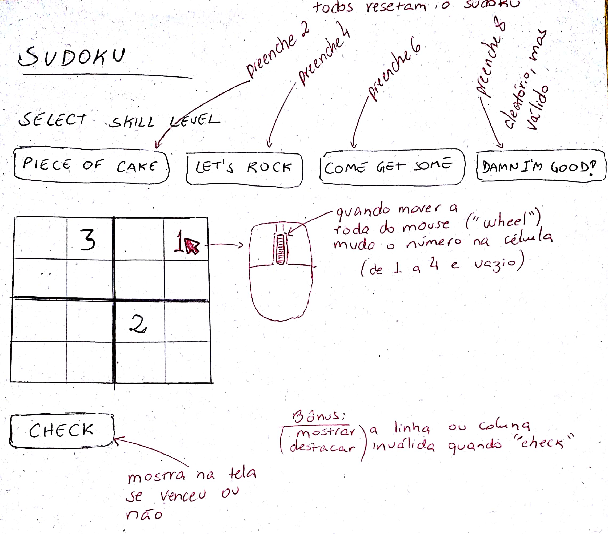

# Atividade Presencial

<https://classroom.github.com/g/tBswyRiR>

## Sudoku

Implementar Sudoku conforme o _sketch_ a seguir.

O evento da roda do mouse é chamado `wheel` e o objeto `WheelEvent` possui uma propriedade `deltaY` que pode ser usada para saber se a roda foi para cima ou baixo.

* * *

*[Difficulty level reference](https://dukenukem.fandom.com/wiki/Difficulty)
